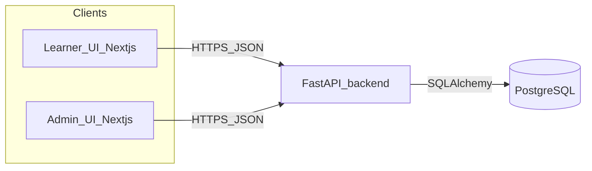

# CS Learning Map — Application System Design (As-Built)

This document describes the **implemented** adaptive learning system in this repository. It aligns with the research specification (LaTeX Section 3 in [`docs/research/research-plan.tex`](research/research-plan.tex)) but is grounded in actual modules, APIs, and schema.

## 1. Context

- **Learner UI:** Next.js 14 (App Router), React Flow for the knowledge graph, Zustand for session state (`learner_id`, goal, current KC, route).
- **Backend:** FastAPI, SQLAlchemy 2.x, Alembic migrations, Pydantic v2.
- **Database:** PostgreSQL (connection string via `DATABASE_URL` in [`backend/app/config.py`](../backend/app/config.py)).

## 2. Technology stack

| Layer | Technology |
|--------|------------|
| Frontend | Next.js 14, TypeScript, Tailwind-style utility classes, React Flow |
| Backend | Python 3.12+, FastAPI, Uvicorn |
| ORM / migrations | SQLAlchemy, Alembic |
| DB | PostgreSQL |
| Optional tutor | OpenAI-compatible HTTP API (see §8) |

## 3. Backend layout

| Area | Path | Role |
|------|------|------|
| App entry | [`backend/app/main.py`](../backend/app/main.py) | FastAPI app, CORS, router registration |
| Config | [`backend/app/config.py`](../backend/app/config.py) | `DATABASE_URL`, `CORS_ORIGINS`, optional `OPENAI_*` |
| Routers | [`backend/app/routers/`](../backend/app/routers/) | HTTP endpoints (`kcs`, `items`, `attempts`, `mastery`, `routes`, `admin`, `tutor`) |
| Services | [`backend/app/services/`](../backend/app/services/) | `bkt.py` (BKT + thresholds + `decide`), `routing.py` (graph + route + reroute target), `decision.py` (attempt pipeline), `tutor.py` + `llm_clients.py` (optional LLM: openai / anthropic / gemini) |
| Models | [`backend/app/models/`](../backend/app/models/) | SQLAlchemy entities |

## 4. Data model (PostgreSQL)

| Table | Key columns | Purpose |
|-------|-------------|---------|
| `kc` | `kc_id`, `name`, `description`, `p_l0`, `p_t`, `p_g`, `p_s`, `created_ts` | Knowledge component + per-KC BKT parameters |
| `prereq_edge` | `edge_id`, `from_kc_id`, `to_kc_id` | Prerequisite: `from` must be mastered before `to` |
| `item` | `item_id`, `kc_id`, `prompt`, `type`, `choices`, `answer`, `difficulty` | Assessment item (v1: one KC per item) |
| `attempt` | `attempt_id`, `learner_id`, `item_id`, `kc_id`, `correctness`, `timestamp`, `metadata` | Observed evidence |
| `mastery` | `mastery_id`, `learner_id`, `kc_id`, `p_mastery`, `attempt_count`, `updated_ts` | Student model state per learner–KC |
| `route` | `route_id`, `learner_id`, `goal_kc_id`, `ordered_kc_ids` (JSONB), `next_kc_id`, timestamps | Cached learning path |

## 5. Policy parameters (BKT + outer loop)

Defined in [`backend/app/services/bkt.py`](../backend/app/services/bkt.py):

| Symbol | Constant | Value | Meaning |
|--------|----------|-------|---------|
| τ_mastery | `TAU_MASTERY` | 0.95 | KC treated as mastered → `advance` |
| τ_low | `TAU_LOW` | 0.40 | Below this after enough attempts → `reroute` eligible |
| k | `K_REROUTE` | 3 | Minimum attempts before reroute |
| P(L₀), P(T), P(G), P(S) | KC columns | defaults 0.1, 0.1, 0.25, 0.1 | Per-KC overrides in DB |

Routing uses the same τ_mastery to decide which nodes are “mastered” for graph purposes ([`routing.py`](../backend/app/services/routing.py)).

## 6. Core runtime flows

### 6.1 Create or refresh route

1. Client: `POST /api/v1/routes` with `{ learner_id, goal_kc_id }`.
2. Server loads mastery map and prerequisite graph, runs `compute_route` ([`routing.py`](../backend/app/services/routing.py)).
3. Persists/updates `route` row; `next_kc_id` = first KC in ordered list.

### 6.2 Practice loop (attempt → BKT → decision)

1. Client: `GET /api/v1/items/next?learner_id=&kc_id=` — picks next item (avoids last 3 seen for variety).
2. Client: `POST /api/v1/attempts` with `{ learner_id, item_id, kc_id, response }`.
3. [`process_attempt`](../backend/app/services/decision.py): validates item/KC, scores MC answer, runs `bkt_update`, `decide`, persists `attempt` + `mastery`.
4. Response includes `decision` (`advance` | `remediate` | `reroute`), mastery before/after, feedback, and human-readable `decision_rationale`.
5. If `advance`: client calls `POST /api/v1/routes/{learner_id}/advance`.
6. If `reroute`: client calls `POST /api/v1/routes/{learner_id}/reroute` ([`find_reroute_target`](../backend/app/services/routing.py)).

### 6.3 Reroute semantics

`reroute` recomputes the ordered route from current mastery, then sets `next_kc_id` to the nearest unmastered predecessor on that path (or first KC on the route).

## 7. HTTP API map (v1)

Prefix: `/api/v1` (see Swagger at `/docs`).

| Method | Path | Purpose |
|--------|------|---------|
| GET | `/kcs`, `/kcs/graph`, `/kcs/{id}` | List KCs, graph for map, single KC |
| GET/POST/PUT/DELETE | `/kcs`, `/kcs/{id}` | Admin KC CRUD (as implemented) |
| GET/POST/DELETE | `/edges`, `/edges/{id}` | Prerequisite edges |
| GET | `/items`, `/items/next`, `/items/{id}` | Item bank + next item |
| POST | `/attempts` | Submit answer → BKT + decision |
| GET | `/attempts` | Attempt history |
| GET/DELETE | `/mastery`, `/mastery/...` | Mastery snapshot + reset |
| POST/GET | `/routes`, `/routes/{learner_id}` | Create/get route |
| POST | `/routes/{learner_id}/advance`, `.../reroute` | After attempt decisions |
| GET/POST | `/admin/stats`, `/admin/seed` | Admin utilities |
| POST | `/tutor/chat` | Optional explanation tutor (requires API key) |

## 8. Optional AI tutor (explanation-only)

- **Config:** `LLM_PROVIDER` = `openai` | `anthropic` | `gemini`. For **openai**: `LLM_API_KEY`, optional `LLM_BASE_URL` / `LLM_MODEL` (OpenAI-compatible chat completions). For **anthropic**: `ANTHROPIC_API_KEY`, optional `ANTHROPIC_MODEL`, `ANTHROPIC_API_URL`, `ANTHROPIC_VERSION`. For **gemini**: `GEMINI_API_KEY`, optional `GEMINI_MODEL`, `GEMINI_API_BASE_URL`. Implementation: [`backend/app/services/llm_clients.py`](../backend/app/services/llm_clients.py).
- **Behavior:** `POST /api/v1/tutor/chat` returns natural-language help. **Sequencing and mastery remain authoritative** in BKT + routing; the model does not change `next_kc_id` or DB state.
- **Code:** [`backend/app/services/tutor.py`](../backend/app/services/tutor.py), [`backend/app/routers/tutor.py`](../backend/app/routers/tutor.py).

## 9. Frontend routes

| Path | Purpose |
|------|---------|
| `/` | Landing — learner id (demo identity) |
| `/goal` | Choose goal KC; creates route |
| `/map` | React Flow graph, route chips, legend, optional tutor panel |
| `/activity` | Next item, submit, mastery bar, decision modals, rationale, tutor |
| `/progress` | Mastery + attempt history |
| `/admin` | KC / item / edge management |

Global navigation: [`frontend/src/components/shared/NavBar.tsx`](../frontend/src/components/shared/NavBar.tsx).

## 10. Mapping: LaTeX design (§3) → implementation

| Research spec (§3) | Implementation |
|--------------------|----------------|
| 3.1 Architecture overview | Next.js ↔ FastAPI ↔ Postgres; services as above |
| 3.2 End-to-end flow | **Diagnostic phase:** not implemented as a separate screen; mastery starts from KC priors and updates on first attempts. Warm-up quiz could reuse the same APIs. |
| 3.3 Core data model | Tables match entities in §4 |
| 3.4 BKT update service | [`bkt.py`](../backend/app/services/bkt.py), invoked from [`decision.py`](../backend/app/services/decision.py) |
| 3.5 Routing + rerouting | [`routing.py`](../backend/app/services/routing.py), [`routes.py`](../backend/app/routers/routes.py) |
| 3.6 Learner UI | Map, route strip, activity, progress; plus **why-next** rationale on route payload and post-attempt text |
| 3.7 Deployment | Per [`README.md`](../README.md) — static/SSR frontend, API process, managed Postgres |

## 11. UX notes (spec vs. built)

- **Strengths:** Map metaphor, visible route, mastery visualization, advance/reroute modals, plain-language policy rationale (API + UI).
- **Gap:** Standalone diagnostic before routing (paper §3.2) is **not** a separate flow; consider documenting as future work or aligning the paper with v1.

---

*For build instructions for the research PDF, see [`docs/research/README.md`](research/README.md).*
